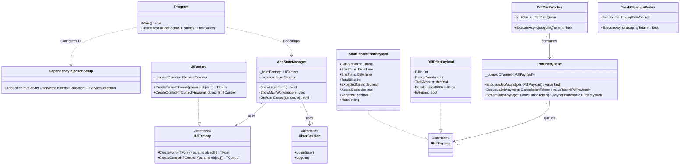
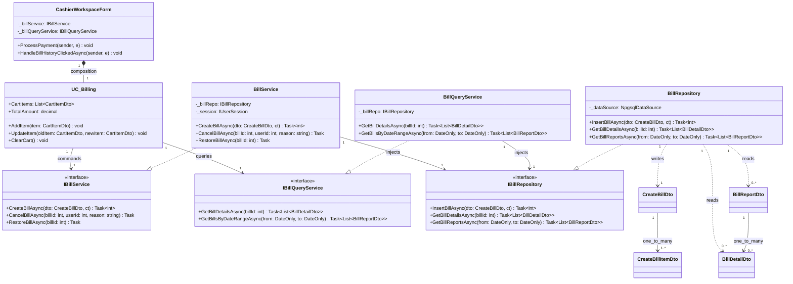
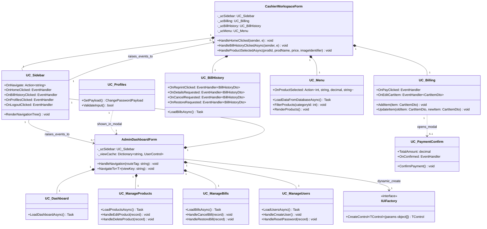

#### 1. Sơ đồ 1: Kiến trúc Lõi & Quản lý tiến trình nền (Core Architecture)

#### 2. Sơ đồ 2: Mô hình Đa tầng & CQRS (N-Layered & CQRS Pattern)

#### 3. Sơ đồ 3: Cấu trúc Giao diện & Trạm làm việc (UI Composition)

