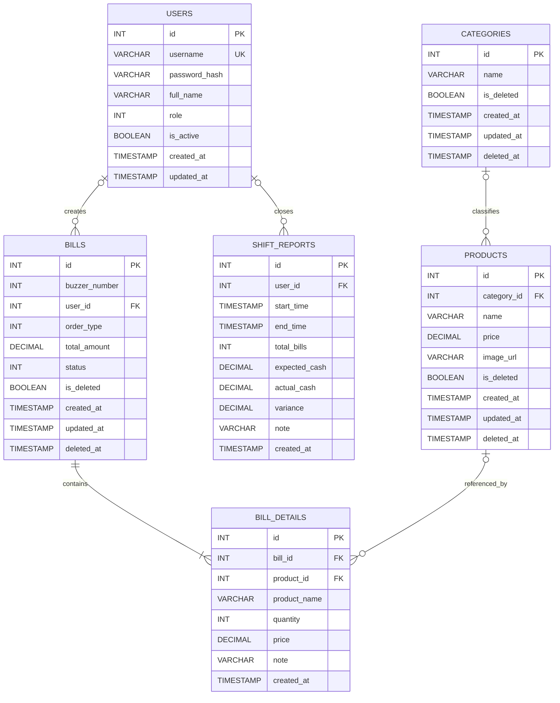
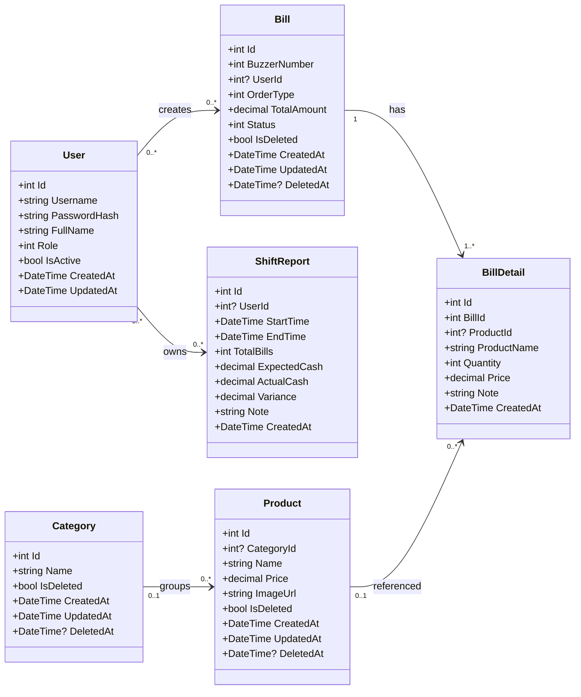

# CoffeePOS - Database Diagrams

## 1. ERD (Entity Relationship Diagram)

```mermaid
erDiagram
    USERS {
        INT id PK
        VARCHAR username UK
        VARCHAR password_hash
        VARCHAR full_name
        INT role
        BOOLEAN is_active
        TIMESTAMP created_at
        TIMESTAMP updated_at
    }

    CATEGORIES {
        INT id PK
        VARCHAR name
        BOOLEAN is_deleted
        TIMESTAMP created_at
        TIMESTAMP updated_at
        TIMESTAMP deleted_at
    }

    PRODUCTS {
        INT id PK
        INT category_id FK
        VARCHAR name
        DECIMAL price
        VARCHAR image_url
        BOOLEAN is_deleted
        TIMESTAMP created_at
        TIMESTAMP updated_at
        TIMESTAMP deleted_at
    }

    BILLS {
        INT id PK
        INT buzzer_number
        INT user_id FK
        INT order_type
        DECIMAL total_amount
        INT status
        BOOLEAN is_deleted
        TIMESTAMP created_at
        TIMESTAMP updated_at
        TIMESTAMP deleted_at
    }

    BILL_DETAILS {
        INT id PK
        INT bill_id FK
        INT product_id FK
        VARCHAR product_name
        INT quantity
        DECIMAL price
        VARCHAR note
        TIMESTAMP created_at
    }

    SHIFT_REPORTS {
        INT id PK
        INT user_id FK
        TIMESTAMP start_time
        TIMESTAMP end_time
        INT total_bills
        DECIMAL expected_cash
        DECIMAL actual_cash
        DECIMAL variance
        VARCHAR note
        TIMESTAMP created_at
    }

    USERS o|--o{ BILLS : creates
    USERS o|--o{ SHIFT_REPORTS : closes
    CATEGORIES o|--o{ PRODUCTS : classifies
    BILLS ||--|{ BILL_DETAILS : contains
    PRODUCTS o|--o{ BILL_DETAILS : referenced_by
```

## 2. Class Diagram (Domain Model)

```mermaid
classDiagram
    direction LR

    class User {
      +int Id
      +string Username
      +string PasswordHash
      +string FullName
      +int Role
      +bool IsActive
      +DateTime CreatedAt
      +DateTime UpdatedAt
    }

    class Category {
      +int Id
      +string Name
      +bool IsDeleted
      +DateTime CreatedAt
      +DateTime UpdatedAt
      +DateTime? DeletedAt
    }

    class Product {
      +int Id
      +int? CategoryId
      +string Name
      +decimal Price
      +string ImageUrl
      +bool IsDeleted
      +DateTime CreatedAt
      +DateTime UpdatedAt
      +DateTime? DeletedAt
    }

    class Bill {
      +int Id
      +int BuzzerNumber
      +int? UserId
      +int OrderType
      +decimal TotalAmount
      +int Status
      +bool IsDeleted
      +DateTime CreatedAt
      +DateTime UpdatedAt
      +DateTime? DeletedAt
    }

    class BillDetail {
      +int Id
      +int BillId
      +int? ProductId
      +string ProductName
      +int Quantity
      +decimal Price
      +string Note
      +DateTime CreatedAt
    }

    class ShiftReport {
      +int Id
      +int? UserId
      +DateTime StartTime
      +DateTime EndTime
      +int TotalBills
      +decimal ExpectedCash
      +decimal ActualCash
      +decimal Variance
      +string Note
      +DateTime CreatedAt
    }

    User "0..*" --> "0..*" Bill : creates
    User "0..*" --> "0..*" ShiftReport : owns
    Category "0..1" --> "0..*" Product : groups
    Bill "1" --> "1..*" BillDetail : has
    Product "0..1" --> "0..*" BillDetail : referenced
```
